# Genomics and Clinical Microbiology 2024

14 - 19 January 2024
 
Wellcome Genome Campus, Hinxton UK

## Topic: Using PubMLST

**Instructors: Dr. Keith Jolley, Dr. Made Krisna, Dr. Kasia Parfitt and Prof. Martin Maiden**

### Identifying alleles and sequence types

#### Determining allele identifier from a sequence
The allele numbers of specific sequences can be determined using the PubMLST typing databases. You may have sequences for MLST loci, surface antigens such as *porA*, or antibiotic resistance genes such as *dhpS* (sulphonamide resistance). Sequence querying works on any length of sequence, including whole genome data, so you can upload contig assemblies to the website for sequence determination of individual loci.

1. From the PubMLST *Neisseria* front page (https://pubmlst.org/neisseria/), navigate to typing database:  

2. Click the ‘Query a sequence’ … ‘Single sequence’ query link:

 
 
 
3. Select the locus from the drop-down box and paste your sequence into the form.  Press ‘Submit’. 

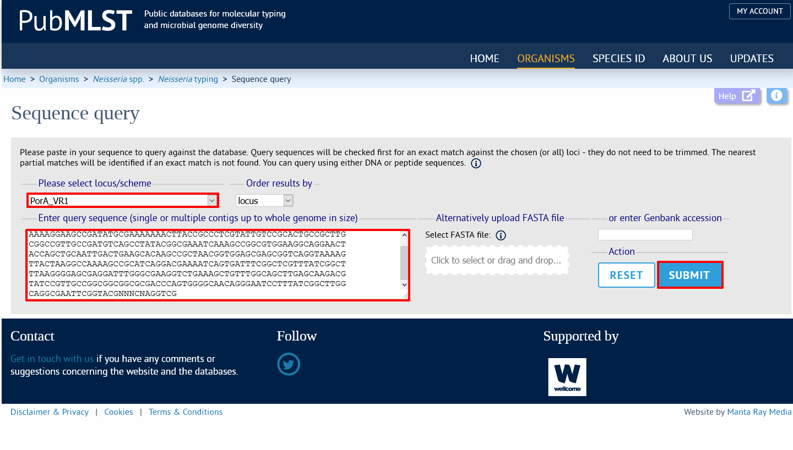

If the sequence has been previously identified, the website will display the corresponding allele/variant identifier:

#### Determining ST from MLST allelic profile
If you have been provided with MLST allelic profile results, you can look up the sequence type (ST) and clonal complex information as follows:

1.	From the PubMLST Neisseria front page (https://pubmlst.org/neisseria/), navigate to the typing database:

2.	Click the ‘Search for allelic profiles’ …  ‘by allelic profile’ link:

3.	Enter the allelic profile into the web form and press ‘Search’:

4.	The ST and clonal complex (if defined) will then be displayed:

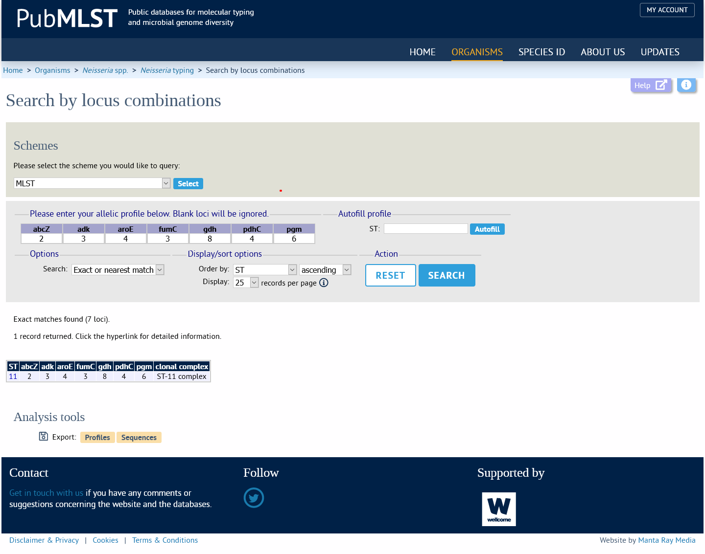

### Querying PubMLST isolate databases
Select the isolate database from a species page on pubmlst.org (e.g. https://pubmlst.org/neisseria/):

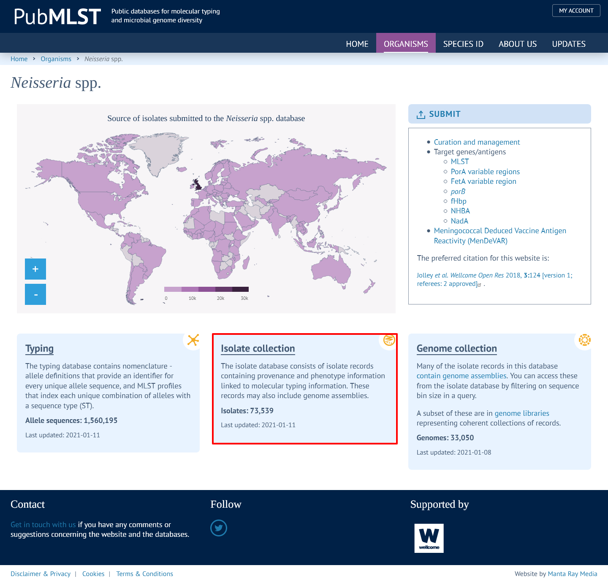

Expand the search menu (click the + next to ‘Search’), and then select ‘Search database’:

#### Searching provenance data
The standard query form initially provides a means to query provenance information, e.g. isolate name, country and year of isolation etc.  To search for all isolates from Africa, select ‘continent’ in the field dropdown box, and enter ‘Africa’ as the value.  Click ‘Search’:

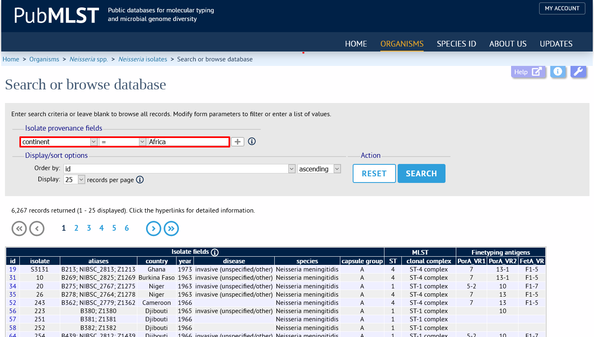

You can build up more complex queries by adding further search terms.  Additional query boxes can be added to the form by clicking the ‘+’ button:

For example, you can combine the previous query with year of isolation, e.g. to select records for isolates isolated from the year 2000 onwards, select ‘year’ in the newly appeared dropdown field box, choose ‘>=’ as the modifier, and enter ‘2000’ as the field value.  Click ‘Search’:

#### Modifying query interface
Sometimes you will want to query by more than just provenance fields.  Additional search criteria can be added to the form by clicking the ‘Modify form options’ tab on the top-right hand side of the page. This has an image of a wrench:

This displays a box that allows you to add additional query types:

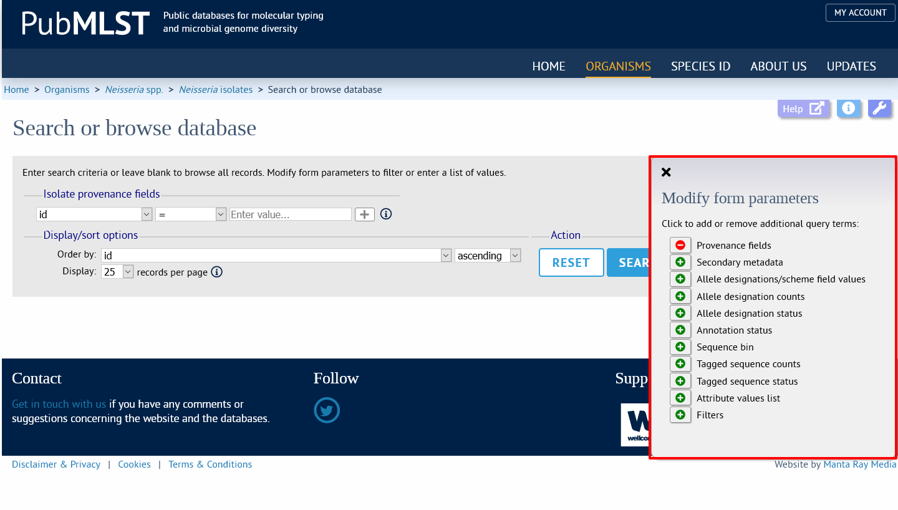

To allow searching by ST or by allele designations, click the ‘Show’ button next to ‘Allele designations/scheme field values’:

Then close the modification box by clicking the [X] in the top left of the box or clicking the ‘Modify form options’ tab again.

#### Searching by MLST alleles/STs
With the allele designation/scheme field query type displayed (see previous section), you can now search by ST, clonal complex or allele designation, e.g. to search the entire database for ST-11 isolates, select ‘ST (MLST)’ from the field list and enter ‘11’ as the value.  Click ‘Search’:

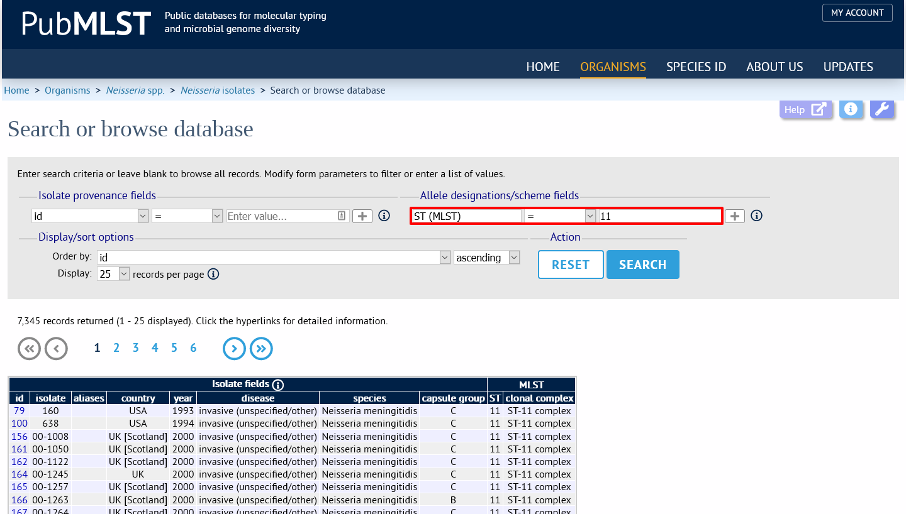

As before, additional query terms can be combined by adding new form elements by clicking the ‘+’ button.  These query terms will be combined with any provenance field queries, e.g. all ST-11 isolates from Africa in years from 2000:

#### Filtering queries
Clicking the ‘Modify form options’ tab, allows you to display various query filters by clicking the ‘Show’ button next to ‘Filters’:

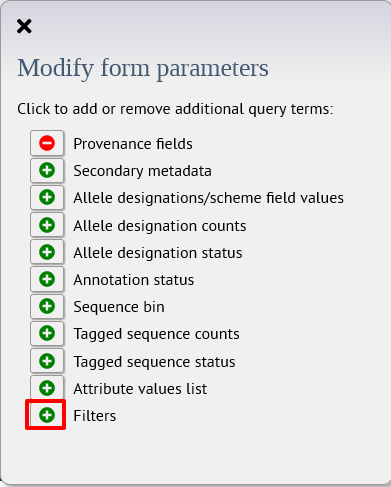

Newly appeared filters include ‘Publication’, ‘MLST profile’ completion and ‘clonal complex’. Other filters can be added by selecting them from the dropdown list and clicking ‘Add filter’. Any filter used will be combined with queries entered in other areas of the form:

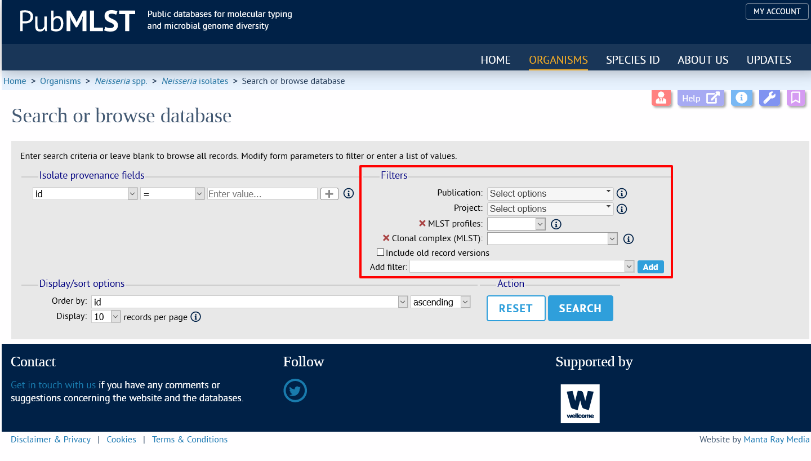

For example, to show ST-11 clonal complex African isolates from 2000, combine the query as below:

#### Analysing returned datasets
At the bottom of any page of results you will find a large number of buttons that will take you to analysis functions using the results of your query:

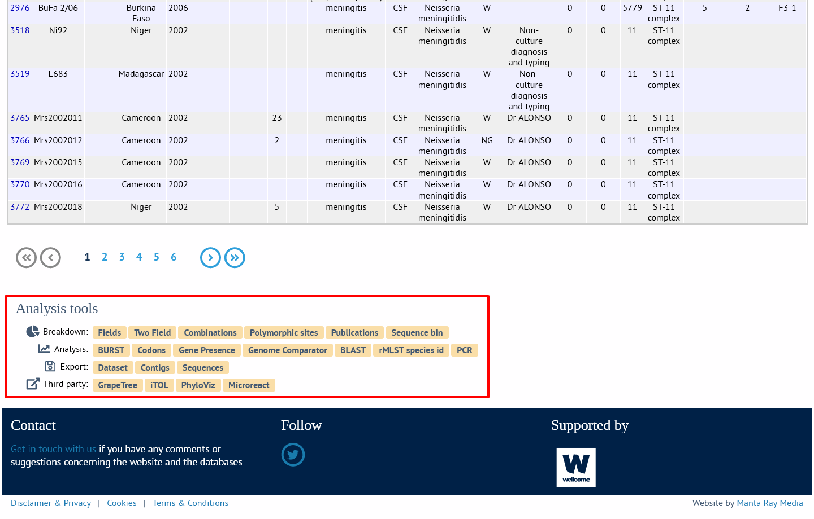

For example, you can breakdown the results by provenance field by clicking the ‘Fields’ button:

A series of maps and charts will be displayed. You can move between charts by selecting different fields in the dropdown box.

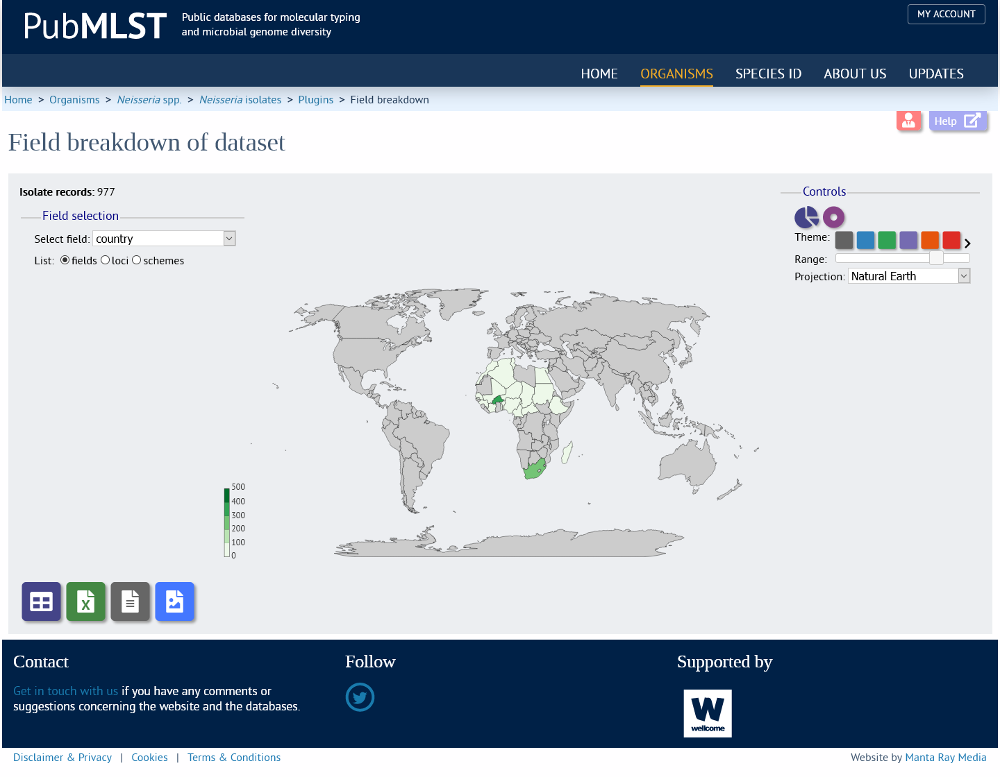

Data for these can additionally be exported in text or Excel formats.
You can also break one field down against another using the ‘Two Field’ breakdown:

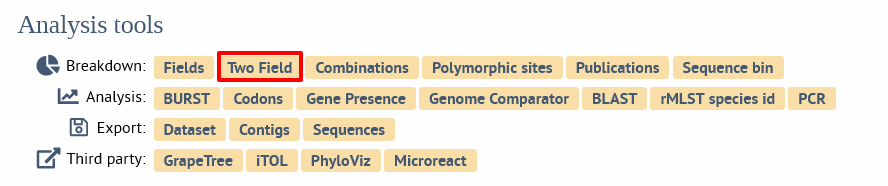

This allows you to combine any field (provenance, allele designation, ST etc.).  For example, country vs capsule group:

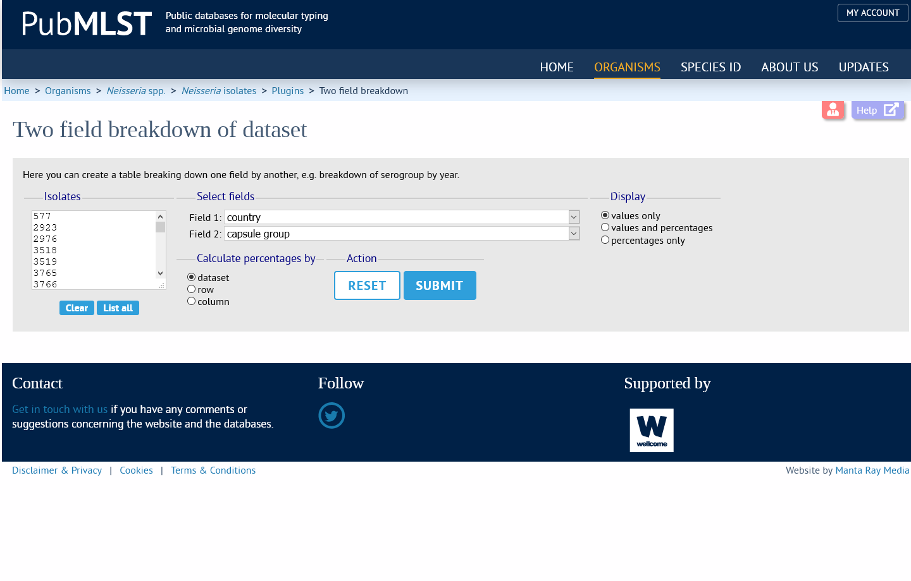

This will display a table of combinations. 

### Whole genome analysis using the BIGSdb platform in PubMLST
A separate database instance has been set up for each participant for when you come to upload and analyse your genome data. This is an isolate database with all Neisseria loci defined as currently used on PubMLST. It also contains genome data for contemporaneous isolates from the same geographical location as the outbreak. You will have curator access to this database in order to upload, scan, tag and analyse sequence data for this practical.
You will be told the web address to use in order to connect to the database which will vary slightly by your user number.

#### Extracting typing data
You have been provided with FASTA files of the sequence contigs assembled from Illumina short read data using the VELVET assembler.  For full analysis you can upload these sequences to the database and associate with an isolate record and we will do this.  You can, however, quickly extract standard typing information (ST, clonal complex, PorA and FetA variants) by querying these sequences against the sequence definition database.  We will do this for just one of the isolates as a demonstration.

1.	From the PubMLST Neisseria front page, navigate to the typing database:

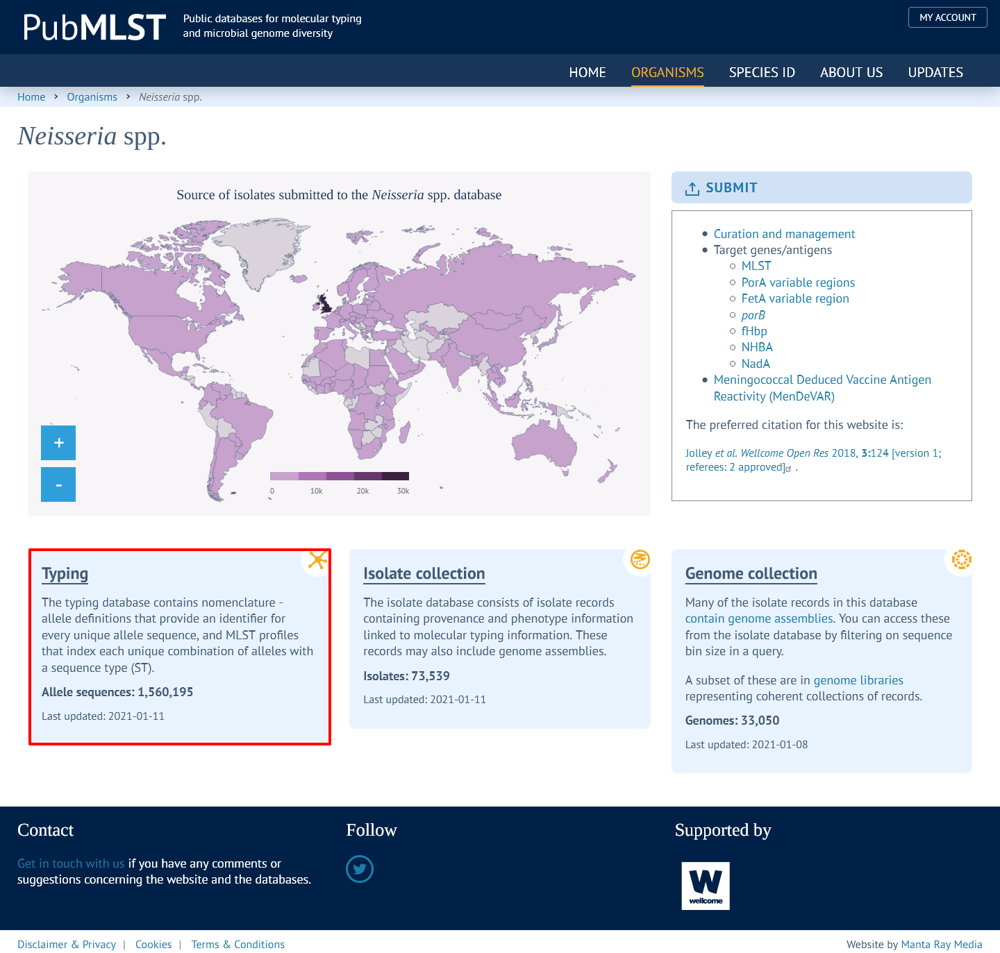

2.	Click the ‘Query a sequence’ … ‘Single sequence’ query link:

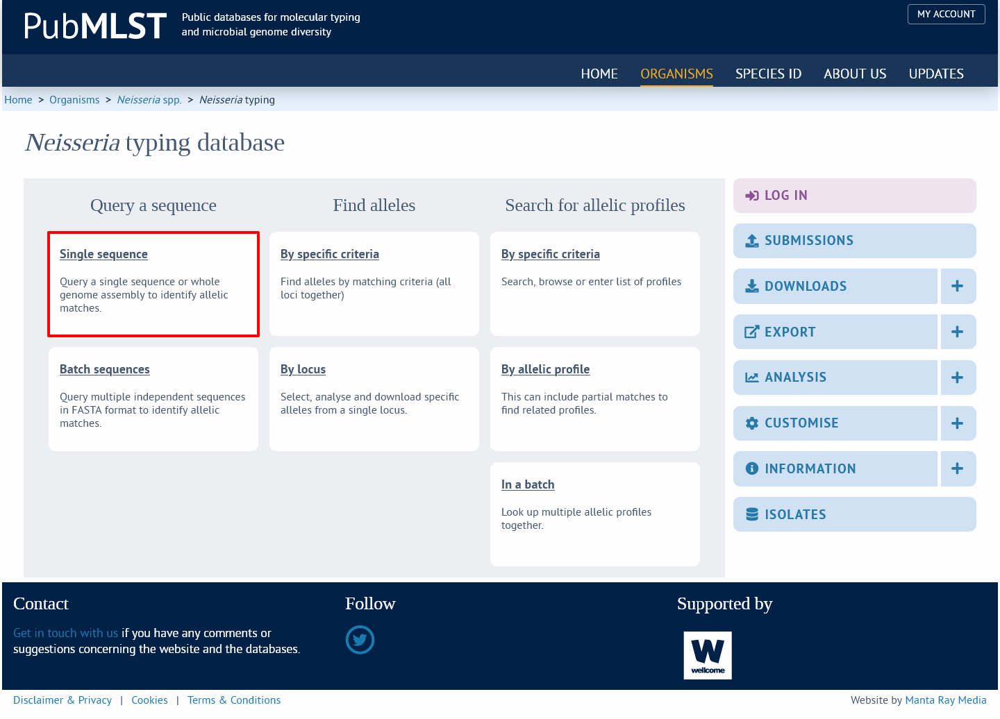

3.	You can either copy and paste the contigs in FASTA format or choose to upload the file.  We will do the latter.  Select the contig file for NZ98/254 by drag and dropping it on to the ‘Upload FASTA’ area, select ‘MLST’ in the locus/scheme dropdown box.  Then click ‘Submit’.

4.	The ST should be displayed in the output section. Repeat, selecting ‘Finetyping antigens’ to get the PorA and FetA results.

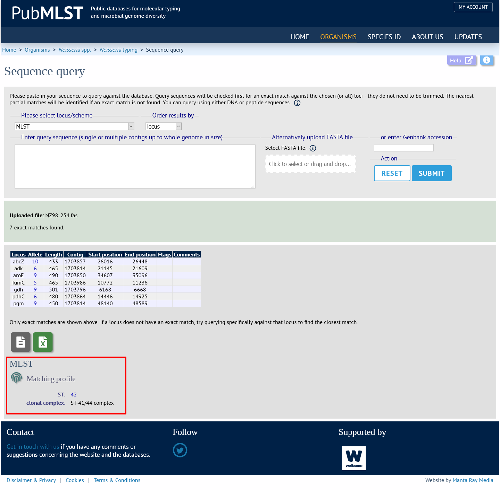

#### Uploading isolate records to the database
While the rapid extraction of typing data is useful for a quick look, more detailed analysis requires loading an isolate record and associated sequence data into the database.

The first stage of this process is creating isolate records for each of the genomes we want to analyse. This can be done through the curation interface either record-by-record - which is ok if you only have one isolate to do, or more usually using a batch upload method. The batch upload can be prepared in Excel, or any other spreadsheet package, and then copy-and-pasted into the batch add web form. 

1.	Select your user number on https://pubmlst.org/training/.

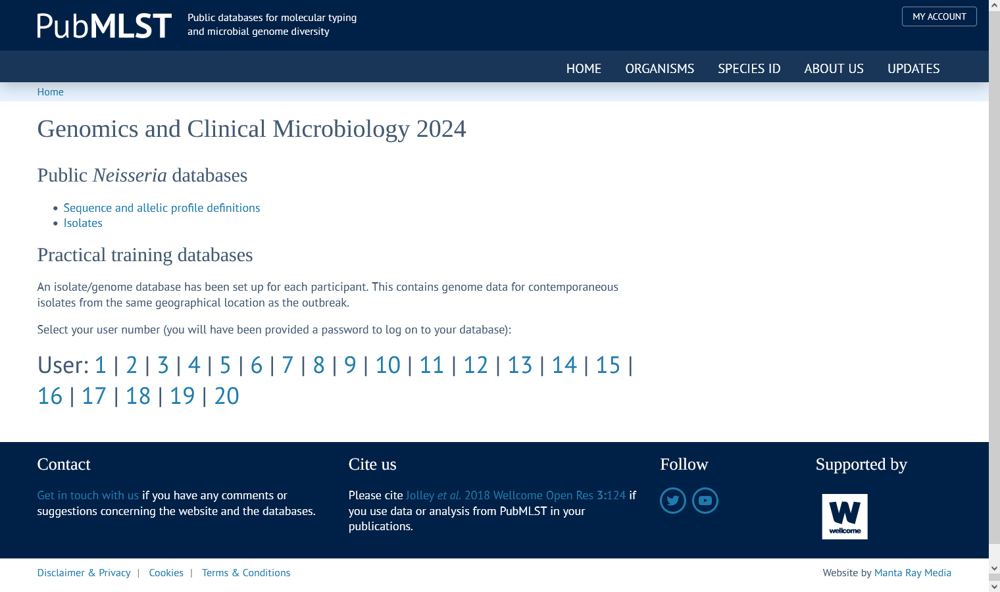

2.	Log in using the account details that you have been provided with:

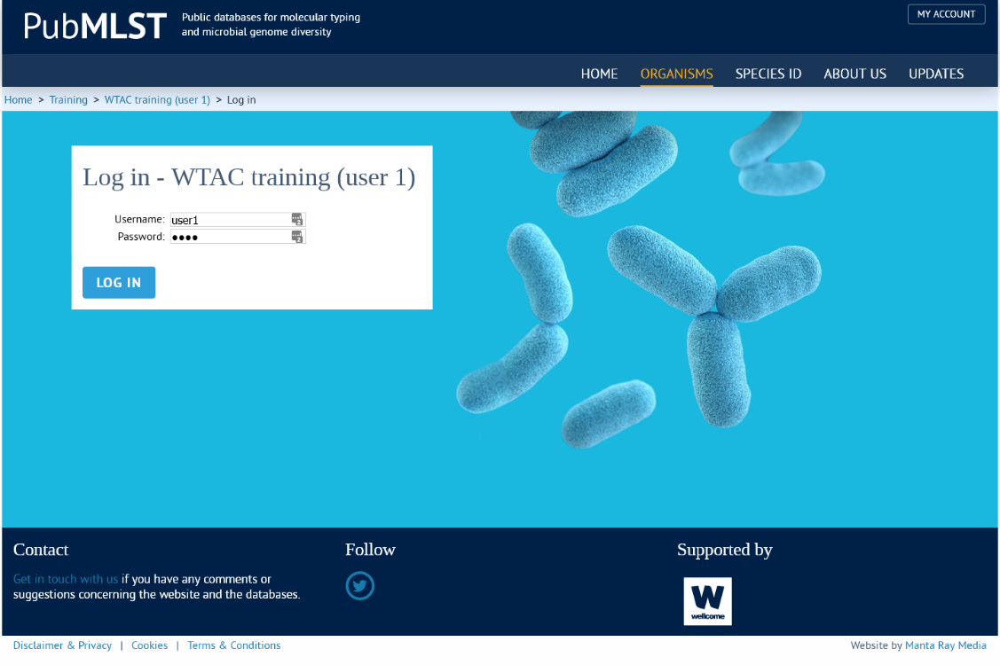

3.	Access the curator interface by clicking the red user icon in the top right of the screen.

4.	You should now have reached the database curator’s page. Click the ‘Batch Add’ isolates link.

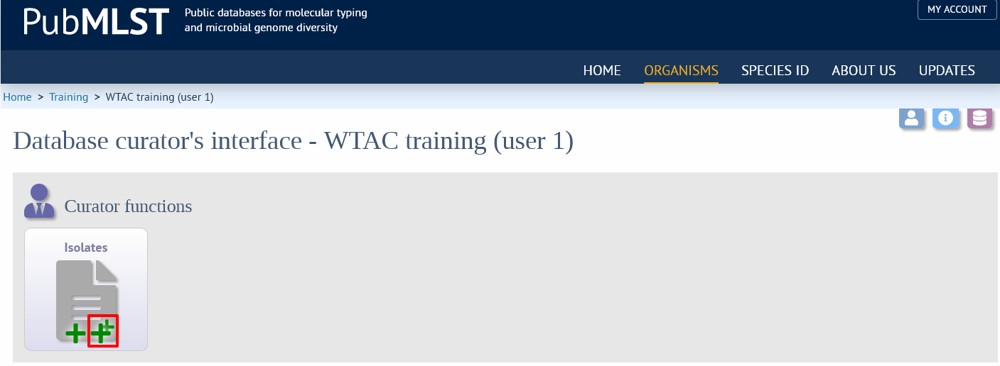

This takes you to a page that allows you to paste in the prepared batch data.  If you were to prepare this data yourself, there is a link that provides an Excel template for you.

However, an upload file has been prepared for you (available in Excel [isolate_records.xlsx]).

5.	Open the isolate_upload.xlsx file in a spreadsheet program, then copy and paste the entire set of data, including headings into the web form.  Do not worry if the formatting appears to be messed up.

6.	Click ‘Submit’.  The data will be checked for formatting and any problems will be highlighted (there should be no errors as the file has been prepared for you).  Finally click the ‘Import data’ button.

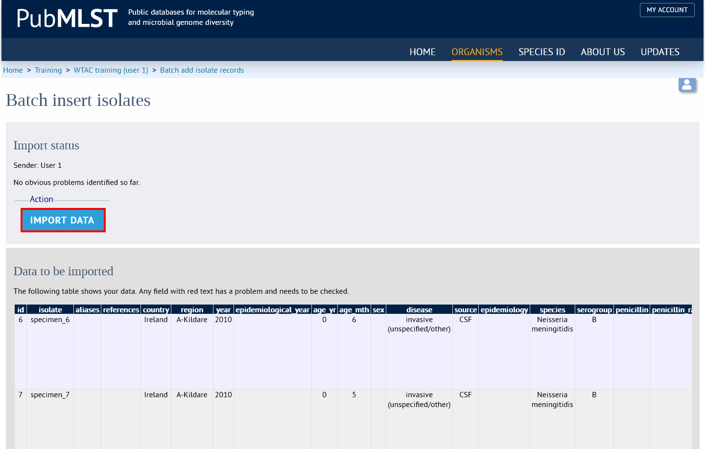

#### Uploading genome data to isolate records
Now that isolate records have been created, the genome data can be uploaded and associated with the appropriate record.

1.	Either, i) immediately after uploading the isolate records, click the DNA icon:

or ii) from the curator index page, click the ‘Batch Add’ sequences link:

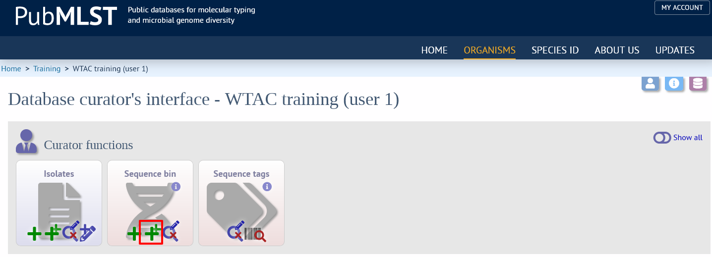

2.	Now we need to tell the system which assembly file belongs to which record. Open the file ‘genome_upload.xlsx’. This contains data in 2 columns: the isolate name, and the assembly filename. Paste the spreadsheet contents into the web form and select ‘isolate’ as the identifying field name. Click ‘Submit’.

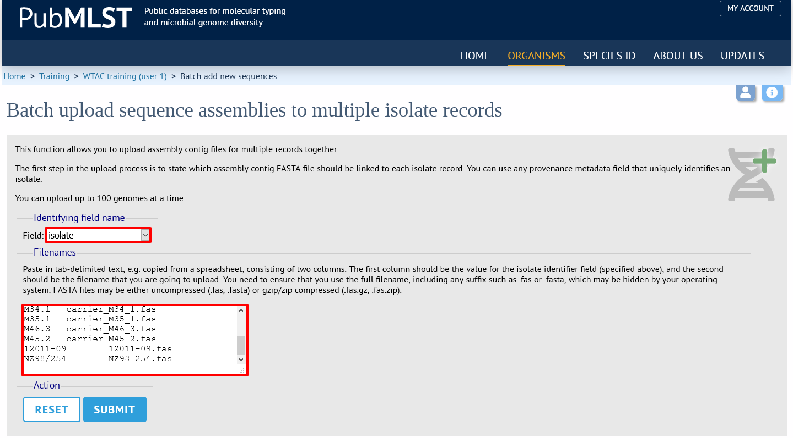

Now drag and drop the files in to the drop file zone.

The files will be uploaded to a staging area.

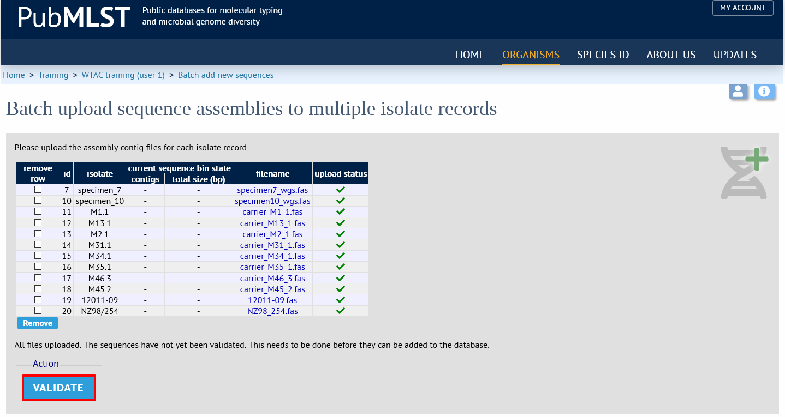

3.	Click ‘Validate’ to check that these files are valid FASTA format. The files will be checked and a table will be displayed showing the total sequence size and number of contigs found. Click ‘Upload validated contigs’.

4.	A confirmation screen will be displayed after a few seconds.

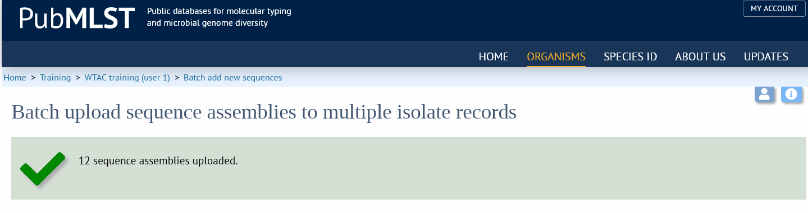

#### Scanning and tagging the typing loci
Blasting the genomes against all known alleles of a particular locus is a process known as ‘scanning’. Marking these identified alleles in the database is termed ‘tagging’.

1.	From the curator’s index page, click ‘Sequence tags .. scan’:

2.	Select a few of your isolates from the isolate selection list and the ‘MLST’ and ‘Finetyping antigens’ checkboxes from the schemes list.  Select ‘Scan selected loci together’ and leave other controls at their default settings and click ‘Scan’:

Scanning takes a few seconds per genome (or a couple of minutes if all loci are selected).  The scan will only look at loci which do not already have an allele designation recorded in the database. The PorA VR and FetA VR loci are defined by peptide sequence - these take slightly longer to scan since the server has to perform a TBLASTX query to determine these. 

3.	When scanning is complete, you should see a list of identified allelic matches and ticked checkboxes.  These indicate that you will tag these alleles in the database.  Click the ‘Tag alleles/sequences’ button: 

The database should update and display a confirmation:

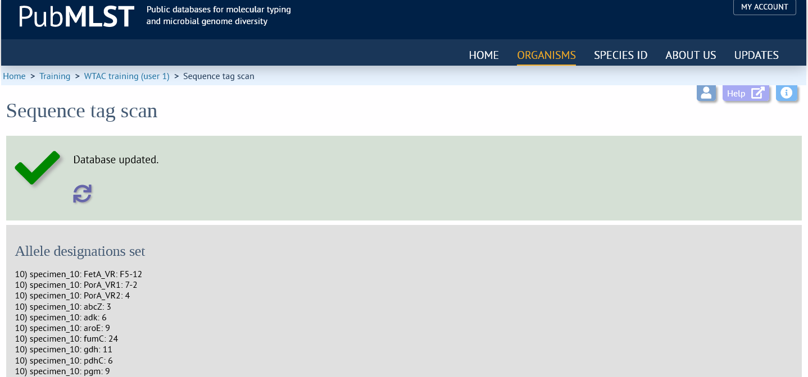

4.	Normally, scanning is an automated process that happens in the background. You can either repeat scanning and tagging for all the other isolates, but if you wait then this will be performed automatically by the autotagger script. This will scan all loci that have been defined in the database.

#### Genome-wide comparison
The information you have extracted so far could have been achieved using conventional MLST and antigen gene sequencing. With the genomes available, however, we can now look at relationships between isolates at a much higher resolution.

The Genome Comparator tool can be used to compare isolates using any sets of loci or against a complete annotated genome.

Make sure you are in the standard query interface (not the curator interface). Either go back to the training front page (https://pubmlst.org/training) and select your user number again, or from the curator interface click the user icon in the top right corner:

First, we will use ribosomal MLST (rMLST).

1.	From the database contents page (not curator’s interface), click the ‘Search database’ link.

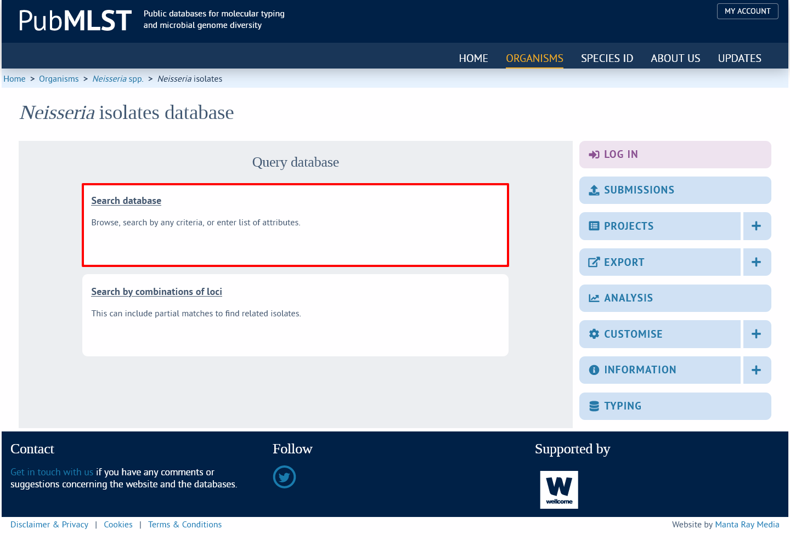

2.	Perform a search to return the isolate records that you have uploaded – your records should all have id numbers less than 20 (other records that already existed in the database and which are contemporaneous isolates have higher id numbers), e.g. search for id <= 20.

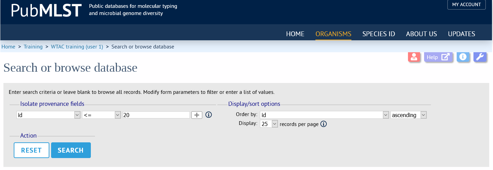

3.	At the bottom of the results table, click the ‘Genome Comparator’ button.

4.	Your isolates will be selected. Choose ‘Ribosomal MLST’ from the recommended schemes list. The database contains other contemporaneous isolates which may help you in your analysis, but for now, limit the analysis to your records. Click ‘Submit’:

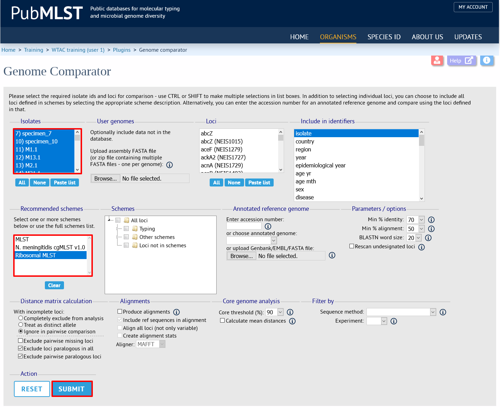

5.	The analysis will be submitted to the job queue and should normally run within a few seconds (it may be a bit longer if the server is busy).

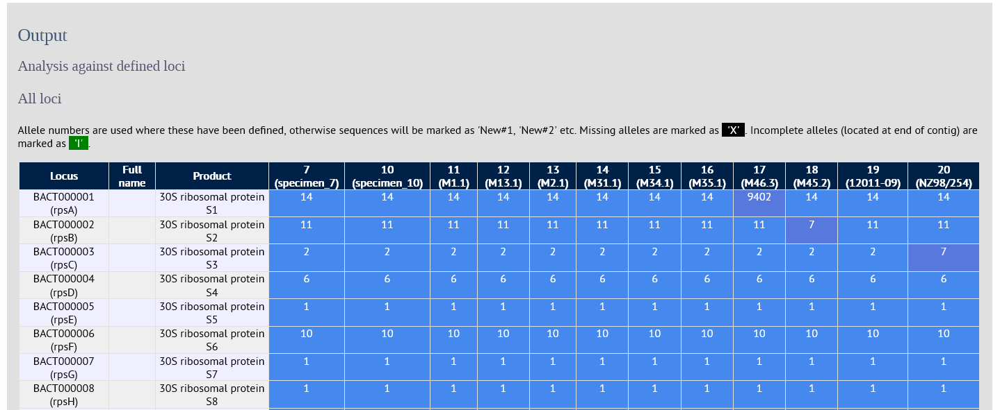

When the analysis completes, a table showing the alleles at each of the rMLST loci will be displayed along with a NeighborNet network.

6.	Now we will analyse the isolates using the cgMLST scheme. This scheme consists of 1422 loci and provides higher resolution than the rMLST scheme. Repeat the Genome Comparator analysis but this time select the cgMLST scheme (*N. meningitidis* cgMLST v2).

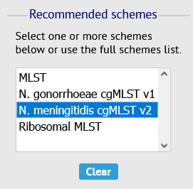

Another tool that you may find very useful is GrapeTree. This generates minimum-spanning trees and allows you to colour isolate nodes with any metadata fields that you wish. Look at the online documentation for further details (https://bigsdb.readthedocs.io/en/latest/data_analysis/grapetree.html).
